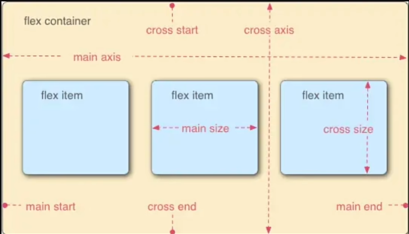

# 什么是JavaScript
JavaScript简称JS.
- JavaScript是一种轻量级、解释型、面向对象的脚本语言。它主要被设计用于在网页上实现动态效果，增加用户与网页的交互性。
- 作为一种客户端脚本语言，JavaScript可以直接嵌入HTML，并在浏览器中执行。
- 与HTML和CSS不同，JavaScript使得网页不再是静态的，而是可以根据用户的操作动态变化的。
# JavaScript的作用
JavaScript在前端开发中扮演着重要的角色，其应用领域包括但不限于：
- 客户端脚本：用于在用户浏览器中执行，实现动态效果和用户交互。
- 网页开发：与HTML和CSS协同工作，使得网页具有更强的交互性和动态性。
- 后端开发：使用Node.js，JavaScript也可以在服务器端运行，实现服务器端应用的开发。
# JS的导入
## 内联样式
在head或者body中些script
## 外联样式
使用script::scr导入外部文件夹的.js

```html
<!DOCTYPE html>

<html lang="en">

<head>

    <meta charset="UTF-8">

    <meta name="viewport" content="width=device-width, initial-scale=1.0">

    <title>导入方式</title>

    <script>

        console.log('hello,body标签的内联样式')

    </script>

  

    <script src="./js/myscript.js"></script>

  

</head>

<body>

    <h1>JavaScript 的导入方式</h1>

    <script>

        console.log('hello,body标签的内联样式')

        alert('hello,body标签的内联样式')

    </script>

</body>

</html>
```

# 基本语法

```js
    <script>

        var a;//声明变量

        // 推荐使用let

        let b = 2;

        // 常量

        const pi = 3.1415926;

        console.log(a);//undefined 已经被声明，但没有赋值

        console.log(b);

        console.log(pi);

        console.log('hello,body标签的内联样式')

  

        let name = '张三';

        console.log(name);

        let empty = null;

        console.log(empty);
    </script>
```
## 条件语句
条件语句是编程中常用的结构，用于基于不同的条件执行不同的代码块。
if语句：用于执行一个代码块，当指定的条件为真（true）时执行。语法如下：
```js
if(condition){
//如果条件为真，执行这里的代码
}
else if{}
else{}
```

## 循环语句
循环语句用于重复执行一段代码，直到指定的条件不再满足为止。
for循环：是一种常见的循环结构，用于按照指定的条件重复执行代码块。语法如下：
```js
for(初始化表达式；循环条件；选代器){
//循环体，执行这里的代码
}
```

while循环。。一样
```js
        let cnt=1

        while(cnt<=8){

            console.log(cnt);

            cnt++;

        }
```
break与continue循环关键字break用于跳出循环，结束循环的执行。continue用于跳过当前循环中的剩余代码，继续下一次循环。
```js
for(var i = 0; i < 5; i++){

            if (i==2){

                continue;

            }

            console.log(i);

            if (i==3){

                break;

            }

        }
```

## 函数
JavaScript函数函数是一段可重复使用的代码块，它接受输入（参数）、执行特定任务，并返回输出。
```js
    <script>

        function sayHello(){

            console.log('hello,函数');

        }

        function sayhelloreturn(){

            return 'hello,函数';

        }

        function sayhelloname(name){

            console.log('hello,'+name);

        }

        sayHello();

        console.log(sayhelloreturn());

        sayhelloname('张三');

  

        //作用域

        let global = 'global';

        function test(){

            let local = 'local';

            console.log('全局'+global);

            console.log('局部'+local);

        }

        test();

        console.log('全局'+global);

        // console.log('局部'+local);

    </script>
```

## 事件
事件是文档或浏览器窗口中发生的特定瞬间，例如用户的点击、键盘的按下、页面的加载等。常见的事件如下：

|     事件      |    描述    |
| :---------: | :------: |
|   onClick   |   点击事件   |
| onMouseOver |   鼠标经过   |
| onMouseOut  |   鼠标移出   |
|  onChange   | 文本内容改变事件 |
|  onSelect   |  文本框选中   |
|   onFocus   |   光标聚集   |
### 事件绑定
JavaScript绑定事件的方法有三种：
1. HTML属性
2. DOM属性
3. addEventListener方法

```html
<!DOCTYPE html>

<html lang="en">

<head>

    <meta charset="UTF-8">

    <meta name="viewport" content="width=device-width, initial-scale=1.0">

    <title>事件处理</title>

</head>

<body>

    <button onclick="clickevent()">这是一个点击事件</button>

    <input type="text" onfocus="focusEvent()" onblur="blurEvent()">

    <script>

        // 事件处理

        // let btn = document.querySelector('button');

        // btn.onclick = function(){

        //     alert('这是一个点击事件');

        // }

        function clickevent(){

            alert('这是一个点击事件');

        }

        //聚焦事件

        function focusEvent(){

            console.log('聚焦事件');

        }

        //失焦事件

        function blurEvent(){

            console.log('失焦事件');

        }

    </script>

</body>

</html>
```

# DOM
在Web开发中，DOM通常与JavaScript一起使用。
当网页被加载时，浏览器会创建页面的文档对象模型，也就是DoM（DocumentObjectModel）。
每个HTML或XML文档都可以被视为一个文档树，文档树是整个文档的层次结构表示。
文档节点是整个文档树的根节点。
DOM为这个文档树提供了一个编程接口，开发者可以使用JavaScript来操作这个树状结构。
## DOM对象常用方法

|        方法         |        描述         |
| :---------------: | :---------------: |
|   appendchild()   |  把新的子节点添加到指定节点。   |
|   removeChild()   |      删除子节点。       |
|  replaceChild()   |      替换子节点。       |
|  insertBefore()   | 在指定的子节点前面插入新的子节点。 |
| createAttribute() |      创建属性节点。      |
|  createElement()  |      创建元素节点。      |
| createTextNode()  |      创建文本节点。      |
|  getAttribute()   |     返回指定的属性值。     |

```html
<!DOCTYPE html>

<html lang="en">

<head>

    <meta charset="UTF-8">

    <meta name="viewport" content="width=device-width, initial-scale=1.0">

    <title>DOM事件</title>

</head>

<body>

    <div id="box1">这是一个ID选择器标签</div>

    <div class="box2">这是一个类选择器标签</div>

    <div>普通div标签</div>

    <button>点击按钮</button>

    <script>

        var element_id=document.getElementById('box1');

        console.log(element_id);

        var element_class=document.getElementsByClassName('box2')[0];

        console.log(element_class);

        var element_tag=document.getElementsByTagName('div')[2];

        console.log(element_tag);

  

        element_id.innerHTML='<a href="#">跳转链接</a>';

        element_class.innerText='<a href="#">跳转链接</a>';

  
  

        element_tag.style.color='red';

        element_tag.style.fontSize='20px';

  

        //通过DOM属性绑定事件

        var btn=document.getElementsByTagName('button')[0];

        console.log(btn);

  

        // btn.onclick=function(){

        //     alert('这是一个点击事件');

        // }

        // btn.addEventListener('click',function(){

        //     alert('通过 addEventListener 触发按键');

        // })

  

        function clickevent(){

            alert('这是一个点击事件');

        }

        btn.onclick=clickevent;

  

    </script>

</body>

</html>
```

# 移动端设备视频

rem适配和响应式适配

## Viewport
在meta里
了解VSCode中自动生成的head标签中的viewport。
viewport可以翻译为视区或者视口。是指浏览器用来显示网页的区域，它决定了网页在用户设备上的显示效果。
```html
<meta name="viewport" content="width=device-width,initial-scale=1.0,minimum-scale=1.0, maximum-scale=1.0, user-scalable=no">
```
1. width=device-width：将视口的宽度设置为设备的宽度。这确保网页内容不会被缩放，而是按照设备的实际宽度进行布局；
2. initial-scale=1.0：设置初始的缩放级别为1.0。这也有助于确保网页在加载时以原始大小显示，而不是被缩小或放大；
3. minimum-scale=1.0：最小缩放比例为1;
4. maximum-scale=1.0：最大缩放比例为1；
5. user-scalable=no：不允许用户缩放。

## rem
在响应式网页与移动端布局时，使用rem而不是px
rem是一个倍数单位，它是基于html标签中的font-size属性值的倍数。
只要我们在不同的设备上设置一个合适的初始值，当设备发生变化font-size就会自动等比适配大小，从而在不同的设备上表现统一。

```html
<!DOCTYPE html>

<html lang="en">

<head>

    <meta charset="UTF-8">

    <meta name="viewport" content="width=device-width, initial-scale=1.0">

    <title>移动端 rem 适配原理</title>

    <style>

        html{

            font-size: 100px;

        }

        .box1-px{

            width: 300px;

            height: 100px;

            background-color: red;

        }

        .box2-rem{

            width: 5rem;

            height: 3rem;

            background-color: blue;

        }

    </style>

</head>

<body>

    <div class="box1-px"></div>

    <div class="box2-rem"></div>

  

    <script>

        function resize(){

            // 获取屏幕宽度

            var width=document.documentElement.clientWidth;

            // 计算 1rem 的值

            var rem=width/10;

            // 设置 html 的 font-size

            document.documentElement.style.fontSize=rem+'px';

        }

        resize();

        window.onresize=resize;

    </script>

</body>

</html>
```

# Flex 弹性盒子与容器属性
在div里面调
## Flex 盒子模型
采用Flex布局的元容器成员，称为Flex项目(flex item),

## Flex 容器属性
Flex容器可以设置以下6个属性：
- flex-direction;
- flex-wrap;
- flex-flow：flex-direction属性和flex-wrap属性的简写形式;
- justify-content;
- align-items;
- align-content：多轴线对齐方式。
### flex-direction
决定主轴的方向 (即项目的排列方向）

|      属性值       |            作用            |
| :------------: | :----------------------: |
|   row (默认值)    | 主轴为水平方向，起点在左端 (项目从左往右排列) |
|  row-reverse   | 主轴为水平方向，起点在右端 (项目从右往左排列) |
|     column     | 主轴为垂直方向，起点在上沿 (项目从上往下排列) |
| column-reverse | 主轴为垂直方向，起点在下沿 (项目从下往上排列) |

### flex-wrap
默认情况下，项目都排列在一条轴线上，如果一条轴线排不下的换行方式，

|     属性值      | 作用                          |
| :----------: | --------------------------- |
|  nowrap（默认）  | 不换行 (列)                     |
|     wrap     | 主轴为横向时：从上到下换行；主轴为纵向时：从左到右换列 |
| wrap-reverse | 主轴为横向时：从下到上换行；主轴为纵向时：从右到左换列 |

### justify-content
定义了项目在主轴上的对齐方式

|      属性值       | 作用                              |
| :------------: | ------------------------------- |
| flex-start（默认） | 与主轴的起点对齐                        |
|    flex-end    | 与主轴的终点对齐                        |
|     center     | 与主轴的中点对齐                        |
| space-between  | 两端对齐主轴的起点与终点，项目之间的间隔都相等         |
|  space-around  | 每个项目两侧的间隔相等。项目之间的间隔比项目与边框的间隔大一倍 |

### align-items
定义项目在交叉轴上如何对齐

|     属性值      | 作用                            |
| :----------: | ----------------------------- |
|  flex-start  | 交叉轴的起点对齐                      |
|   flex-end   | 交叉轴的终点对齐                      |
|    center    | 交叉轴的中点对齐                      |
|   baseline   | 项目的第一行文字的基线对齐                 |
| stretch（默认值） | 如果项目未设置高度或设为auto，项目将占满整个容器的高度 |

### align-content
定义了多根轴线的对齐方式。如果项目只有一根轴线，该属性不起作用。

|      属性值      | 作用                               |
| :-----------: | -------------------------------- |
|  flex-start   | 与交叉轴的起点对齐                        |
|   flex-end    | 与交叉轴的终点对齐                        |
|    center     | 与交叉轴的中点对齐                        |
| space-between | 与交叉轴两端对齐，轴线之间的间隔平均分布             |
| space-around  | 每根轴线两侧的间隔都相等，轴线之间的间隔比轴线与边框的间隔大一倍 |
| stretch（默认值）  | 主轴线占满整个交叉轴                       |
