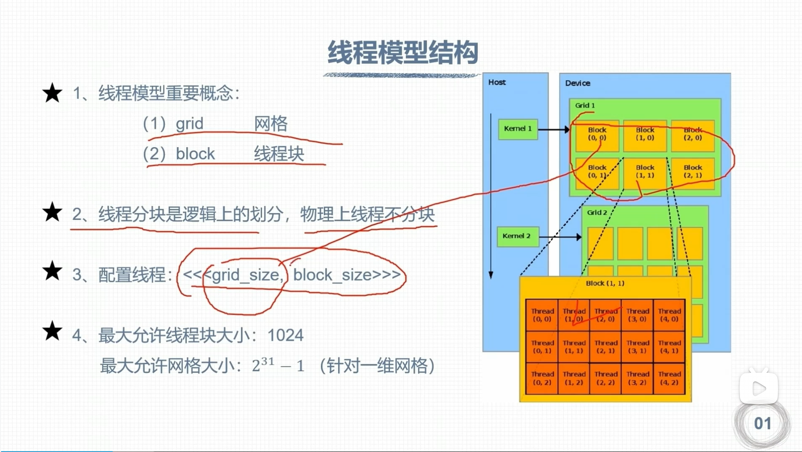
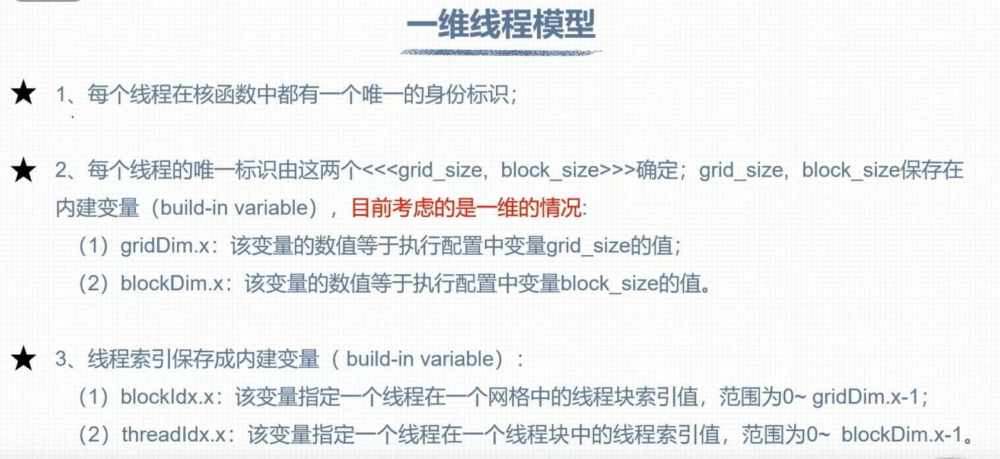
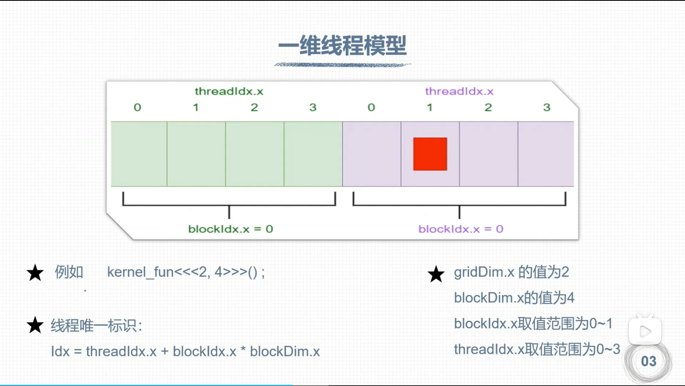
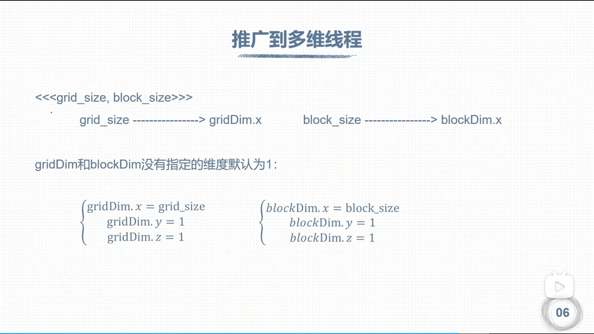

# WSL2 安装nvcc
```bash
sudo apt install nvidia-cuda-toolkit
```

## 验证nvcc的安装
```
nvcc --version
nvcc: NVIDIA (R) Cuda compiler driver
Copyright (c) 2005-2021 NVIDIA Corporation
Built on Thu_Nov_18_09:45:30_PST_2021
Cuda compilation tools, release 11.5, V11.5.119
Build cuda_11.5.r11.5/compiler.30672275_0
```

# 写一个Helloworld
## 新建一个.cu的文件
假设为 `test.cu`
```cpp
#include <stdio.h>

__global__ void hello_from_gpu(void) { //__global__定义核函数

    printf("Hello from GPU!\n"); //这会在GPU的所有线程中打印

}

int main(void) {

    hello_from_gpu<<<1, 10>>>(); //前面的1代表网格数，后面的10代表10个block

    cudaDeviceSynchronize();    //这个函数会等待GPU上的所有线程都执行完

    return 0;

}
```

## 使用nvcc编译
```bash
nvcc test.cu -o test
```
即在项目路径下编译一个名为test的可执行文件

## 运行可执行文件
```bash
./test
```
结果
```bash
(base) mzm@JimmyMa:~/Code/cudacode/$ ./test 
Hello from GPU!
Hello from GPU!
Hello from GPU!
Hello from GPU!
Hello from GPU!
Hello from GPU!
Hello from GPU!
Hello from GPU!
Hello from GPU!
```

# 理论部分


## 线程模块结构
### 1.线程模型重要概念
	- grid 网格
	- block 线程块
### 2.线程分块是逻辑上划分，物理上不分块
### 3.线程配置<<grid_size, block_size>>
### 4.最大允许线程块大小：1024 & 最大允许网格大小：$2^{31}-1$(针对一维网格)

> 设计总的线程数至少等于（>=）核心数才能充分发挥GPU资源

## 一维线程模型

1. 每个线程在核函数中都有一个唯一的身份标识
2. 每个线程的唯一标识由这两个<<<grid_size，block_size>>>确定;grid_size，block size保存在内建变量（build-invariable）目前考虑的是一维的情况：
	1. gridDim.x.变是的数量的数值等于执行配置中变量grid_size的值；
	2. blockDim.x：该变量的数值等于执行配置中变量block_size的值。
3. 线程索引l保存成内建变量（build-invariable）
	1. blockldx.x：该变量指定一个线程在一个网格中的线程块索引l值，范围为0~gridDim.x-1;
	2. threadldx.x：该变量指定一个线程在一个线程块中的线程索引值，范围为0~blockDim.x-1。
	>可以简单理解为n行m列，但事实上是第n个grid的第m个block
	>在block里区分不同的thread
	
	
	>一维模型中的线程Idx计算公式为 
	$Idx=threadIdx.x+blockIdx.x+blockDim.x$

测试代码
```cpp
#include <stdio.h>

__global__ void hello_from_gpu(void) {

    const int bid = blockIdx.x; //这个函数会返回当前block的ID

    const int tid = threadIdx.x; //这个函数会返回当前线程的ID

    const int id = threadIdx.x + blockIdx.x * blockDim.x; //这个函数会返回当前线程的全局ID

    printf("Hello from block %d, thread %d, global thread %d!\n", bid, tid, id); //这会在GPU的所有线程中打印

    // printf("Hello from GPU!\n"); //这会在GPU的所有线程中打印

}

int main(void) {

    hello_from_gpu<<<2, 4>>>(); //grid的大小是2，block的大小是4

    cudaDeviceSynchronize();    //这个函数会等待GPU上的所有线程都执行完

    return 0;

}
```
## 推广到多维线程

blockIdx和threadIdx是结构体，分别由x, y, z三个成员

推广到多维线程<<<grid_size,block_size>>>
grid_size-->gridDim.x
block_size-->blockDim.x
gridDim和blockDim没有指定的维度默认为1



## 如何定义多维网格
```cpp
//定义多维网格和线程块（cpp构造函数语法）
dim3 grid_size(Gx,Gy,Gz);
dim3 block_size(Bx,By,Bz);
//如果不写，默认为1
//e.g.
dim3 grid_size(3,3);//dim3 grid_size(3,3,1);

```

>多维网格变化是先变x，与矩阵的 [行，列] 不同，矩阵先变列后变行，网格是 [x,y] 先x后y 每一个线程都有唯一标识

网格大小限制
	gridDim.x最大值为 $2^{31}-1$
	gridDim.y最大值为 $2^{16}-1$
	gridDim.z最大值为 $2^{16}-1$
线程块大小限制
	blockDim.x最大值为 $1024$
	blockDim.y最大值为 $1024$
	blockDim.z最大值为 $64$
	线程块总得大小最大为1024!!
	
