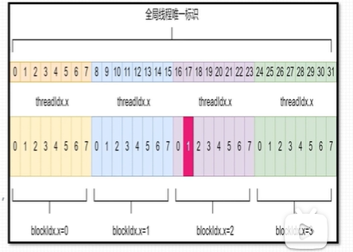
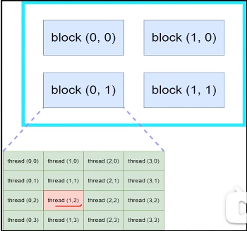
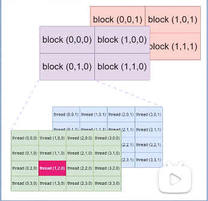
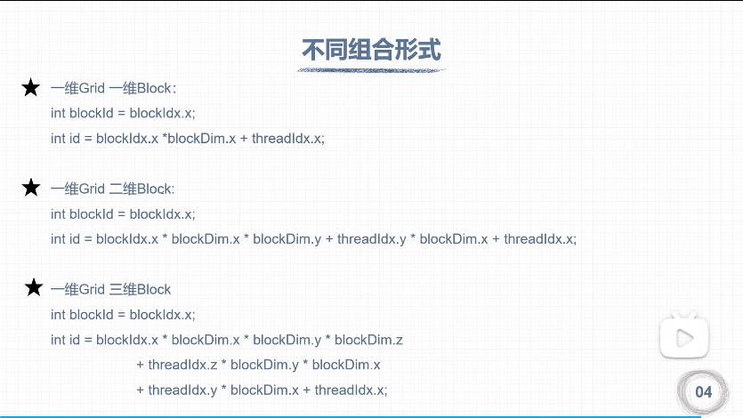
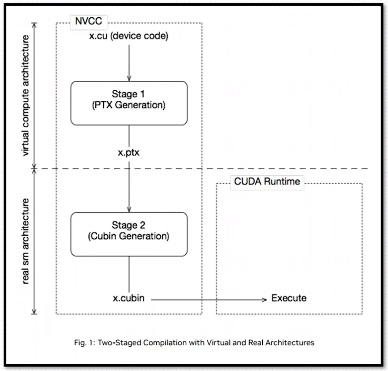
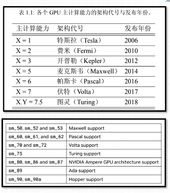
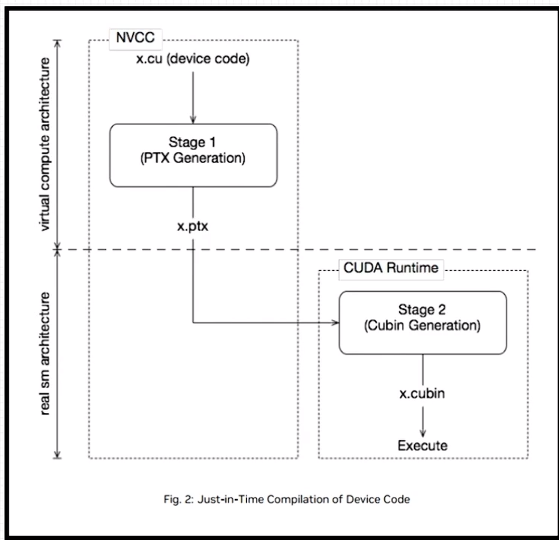

# 线程全局索引计算方式
## 线程全局索引
### 一维网格 一维线程块

- 定义grid和block尺寸：`dim3 grid_size(4);dim3block_size(8);`
- 调用核函数：`kernel fun<<<grid_size,block_size>>>(...);`
- 具体的线程索引方式如图所示，blockIdx.x从0到3,threadIdx.x从0到7
- 计算方式：int id=blockIdx.x * blockDim.x+threadIdx.x;

### 二维网格 二维线程块

- 定义grid和block尺寸：`dim3 grid_size(2,2);dim3 block_size（4,4);`
- 调用核函数：`kernel fun<<<grid_size,block_size>>>(...);`
- 具体的线程索引l方式如图所示，blockIdx.x和blockIdx.y从0到1，threadIdx.x和threadIdx.y从0到3。
- 计算方式：
```
int blockId=blockIdx.x+blockId.ygridDim.x;
int threadId=threadIdx.y * blockDim.x + threadIdx.x;
int id=blockId * (blockDim.xblockDim.y)  +threadId;
```

### 三维网格 三维线程块

- 定义grid和block尺寸：`dim3 grid_size(2,2,2);dim3 block_size（4,4,2);`
- 调用核函数：`kernel fun<<<grid_size,block_size>>>(...);`
- 具体的线程索引l方式如图所示，blockIdx.x、blockIdx.y和blockIdx.z从0到1，threadIdx.x和threadIdx.y从0到3，threadIdx.z从0到1。
- 计算方式：
```
intblockld=blockldx.x+blockldx.ygridDim.x+gridDim.x*gridDim.y*blockldx.z;intthreadld=（threadldx.z*(blockDim.x*blockDim.y)+（threadldx.y*blockDim.x)+threadldx.x;
int id = blockId * (blockDim.x * blockDim.y * blockDim.z) + threadIdx.x

```

## 不同组合方式列举


# nvcc编译流程与GPU计算能力
## nvcc编译流程
1. nvcc分离全部源代码为：（1）主机代码（2）设备代码
2. 主机（Host）代码是C/C++语法，设备（device）代码是C/C++扩展语言编写
3. nvcc先将设备代码编译为PTX（ParallelThreadExecution）伪汇编代码，再将PTx代码编译为二进制的cubin目标代码
4. 在将源代码编译为PTX代码时，需要用选项-arch=compute_XY指定一个虚拟架构的计算能力，用以确定代码中能够使用的CUDA功能。
5. 在将PTX代码编译为cubin代码时，需要用选项-code=sm_ZW指定一个真实架构的计算能力，用以确定可执行文件能够使用的GPU。
### PTX

- PTX（ParallelThread Execution）是CUDA平台为基于GPU的通用计算而定义的虚拟机和指令集
- nvcc编译命令总是使用两个体系结构：一个是虚拟的中间体系结构，另一个是实际的GPU体系结构
- 虚拟架构更像是对应用所需的GPU功能的声明
- 虚拟架构应该尽可能选择低---适配更多实际GPU真实架构应该尽可能选择高---充分发挥GPU性能
- PTX文档：https://docs.nvidia.com/cuda/parallel-thread-execution/index.html

## GPU计算能力

1. 每款GPU都有用于标识“计算能力”（compute capability)的版本号
2. 形式X.Y，X标识主版本号，Y表示次版本号

# CUDA程序兼容性问题
- 指定虚拟架构计算能力

- 指定真实架构计算能力

- 指定多个GPU版本编译

## nvcc即时编译

## nvcc编译默认计算能力
- C/C++源码编译为PTX时，可以指定虚拟架构的计算能力，用来确定代码中能够使用的CUDA功能
- C/C++源码转化为PTX这一步骤与GPU硬件无关编译指令（指定虚拟架构计算能力）：-arch=compute_XY XY：第一个数字X代表计算能力的主版本号，第二个数字Y代表计算能力的次版本号
- PTX的指令只能在更高的计算能力的GPU使用例如：nvcc helloworld.cu -o helloworld -arch=compute_61 编译出的可执行文件helloworld可以在计算能力>=6.1的GPU上面执行，在计算能力小于6.1的GPU则不能执行。

## 指定真实架构计算能力
- PTX指令转化为二进制cubin代码与具体的GPU架构有关
- 编译指令（指定真实架构计算能力）-code=sm_XY  XY：第一个数字X代表计算能力的主版本号，第二个数字Y代表计算能力的次版本号
- 注意：
	- （1）二进制cubin代码，大版本之间不兼容！！！
	- （2）指定真实架构计算能力的时候必须指定虚拟架构计算能力！！！
	- （3）指定的真实架构能力必须大于或等于虚拟架构能力！！！~~nvcc helloworld.cu -o helloworld -arch=compute_61-code=sm_60
- 真实架构可以实现低小版本到高小版本的兼容！
```bash
nvcc helloworld.cu -o helloworld -arch=compute_60 -code=sm_60
```

## 指定多个GPU版本编译
- 使得编译出来的可执行文件可以在多GPU中执行
- 同时指定多组计算能力：
	编译选项-gencode arch=compute_XY -code=sm_XY
	例如：
	-gencode=arch=compute_35,code=sm_35开普勒架构
	-gencode=arch=compute_50,code=sm_50麦克斯韦架构
	-gencode=arch=compute_60,code=sm_60帕斯卡架构
	-gencode=arch=compute_70,code=sm_70伏特架构
- 编译出的可执行文件包含4个二进制版本，生成的可执行文件称为胖二进制文件（fatbinary）
- 注意：
	- （1）执行上述指令必须CUDA版本支持7.0计算能力，否则会报错
	- （2）过多指定计算能力，会增加编译时间和可执行文件的大小

## nvcc即时编译
可以用于低主版本号真实架构编译高主版本号
- 在运行可执行文件时，从保留的PTX代码临时编译出cubin文件
- 在可执行文件中保留PTX代码，nvcc编译指令指定所保留的PTX代码虚拟架构：
	- 指令：-gencodearch=compute_XY,code=compute_XY
	- 注意：
		- (1)两个计算能力都是虚拟架构计算能力
		- (2)两个虚拟架构计算能力必须一致
- 例子
	- -gencode=arch=compute_35,code=sm_35
	- -gencode=arch=compute_50,code=sm_50
	- -gencode=arch=compute_61,code=sm_61
	- -gencode=arch=compute_61,code=computee61
- 简化：-arch=sm_XY
	- 等价于
	- -gencode=arch=compute_61,code=sm_61
	- -gencode=arch=compute_61,code=compute_61
## nvcc默认计算能力
不同版本CUDA编译器在编译CUDA代码时，都有一个默认计算能力

|  CUDA版本  | 默认计算能力 |
| :------: | :----: |
|  6.0及更早  |  1.0   |
| 6.5~8.0  |  2.0   |
| 9.0~10.2 |  3.0   |
|   11.6   |  5.2   |
### 如何查看？
```bash
#通过-ptx 编译出。ptx
nvcc helloworld_test.cu -ptx
#查看文件
cat helloworld_test.ptx 
```

```
//
// Generated by NVIDIA NVVM Compiler
//
// Compiler Build ID: CL-30672275
// Cuda compilation tools, release 11.5, V11.5.119
// Based on NVVM 7.0.1
//

.version 7.5
.target sm_52
.address_size 64

        // .globl       _Z14hello_from_gpuv
.extern .func  (.param .b32 func_retval0) vprintf
(
        .param .b64 vprintf_param_0,
        .param .b64 vprintf_param_1
)
;
.global .align 1 .b8 $str[17] = {72, 101, 108, 108, 111, 32, 102, 114, 111, 109, 32, 71, 80, 85, 33, 10, 0};

.visible .entry _Z14hello_from_gpuv()
{
        .reg .b32       %r<2>;
        .reg .b64       %rd<4>;


        mov.u64         %rd1, $str;
        cvta.global.u64         %rd2, %rd1;
        mov.u64         %rd3, 0;
        { // callseq 0, 0
        .reg .b32 temp_param_reg;
        .param .b64 param0;
        st.param.b64    [param0+0], %rd2;
        .param .b64 param1;
        st.param.b64    [param1+0], %rd3;
        .param .b32 retval0;
        call.uni (retval0), 
        vprintf, 
        (
        param0, 
        param1
        );
        ld.param.b32    %r1, [retval0+0];
        } // callseq 0
        ret;

}
```
.target sm_52 默认计算能力是5.2